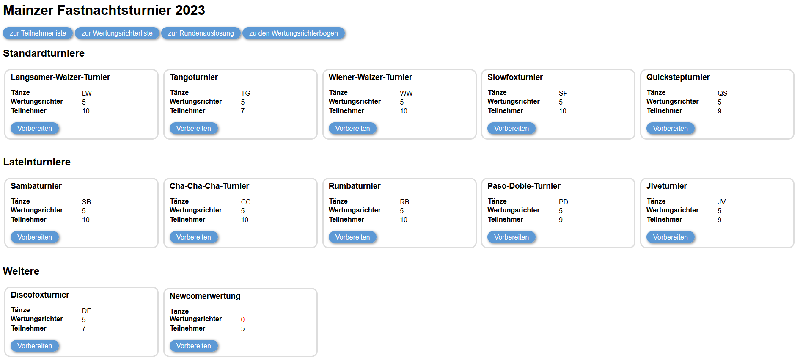
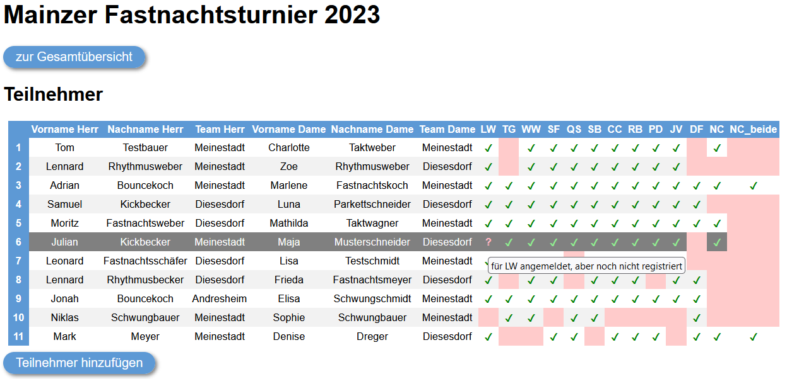
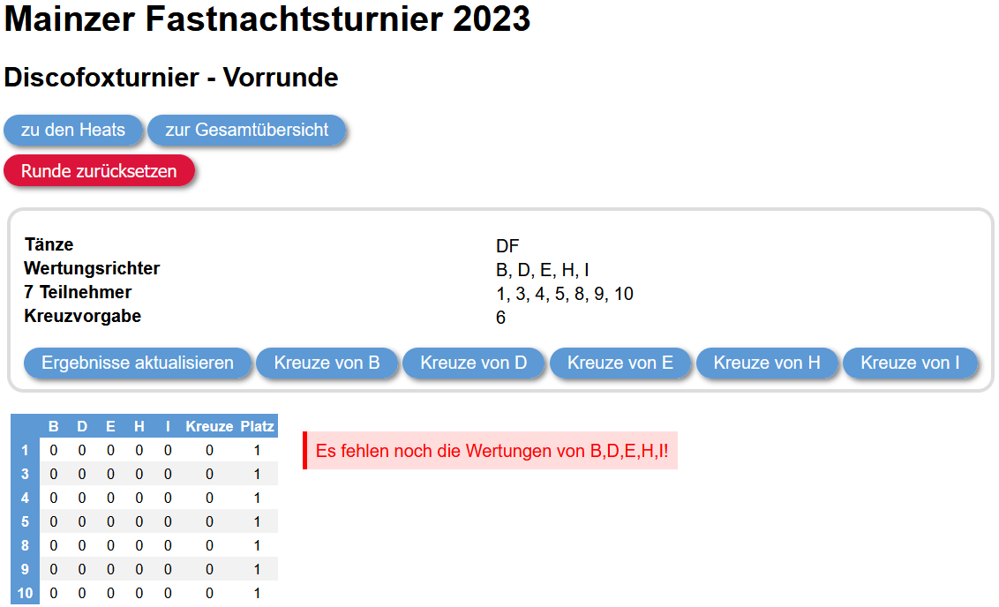
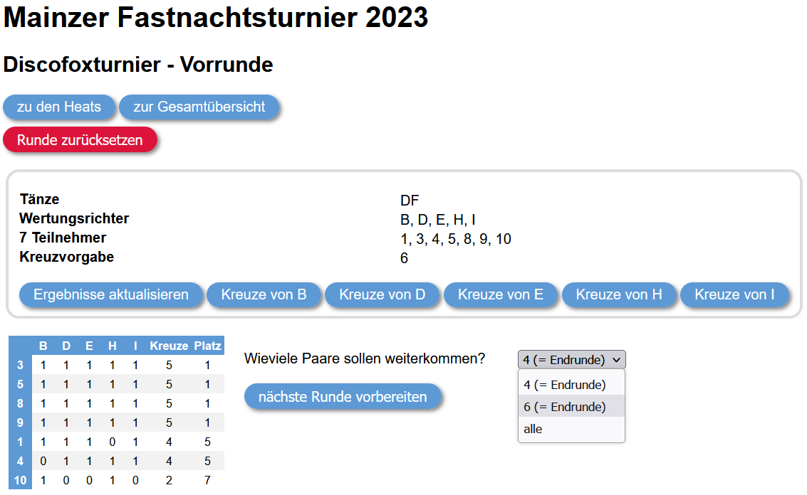
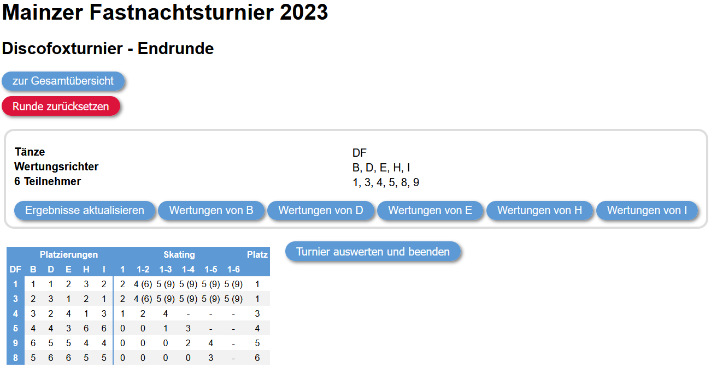
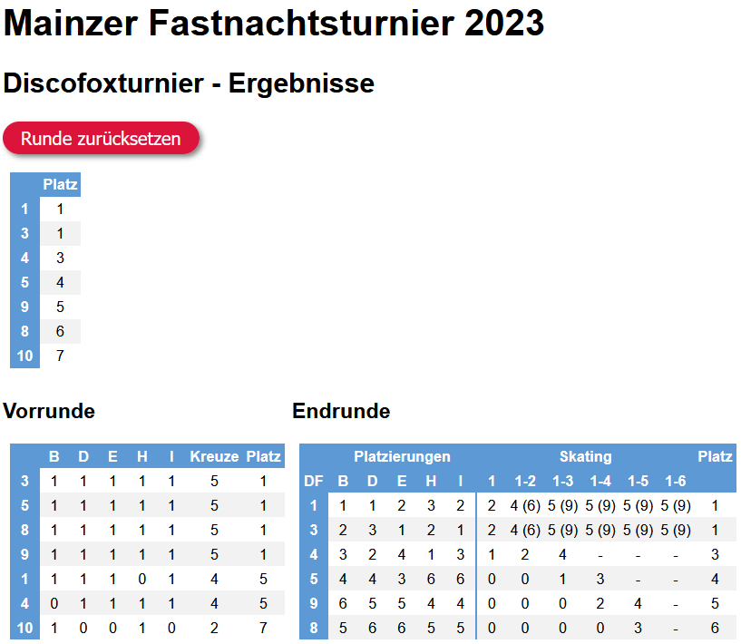
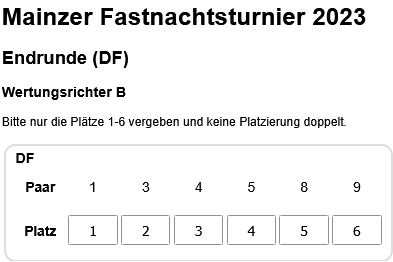
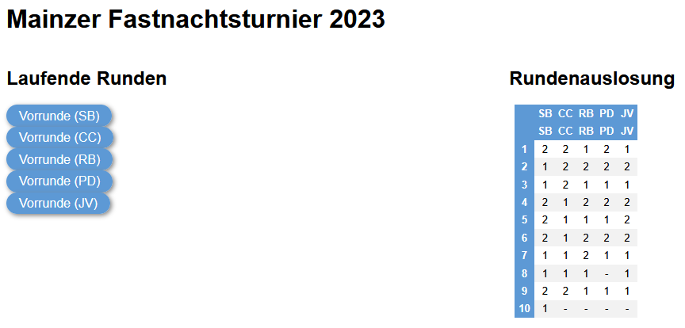
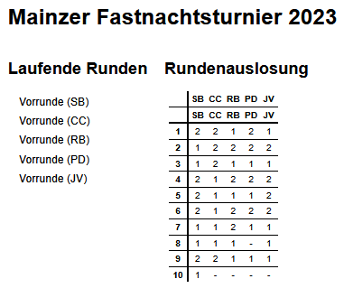
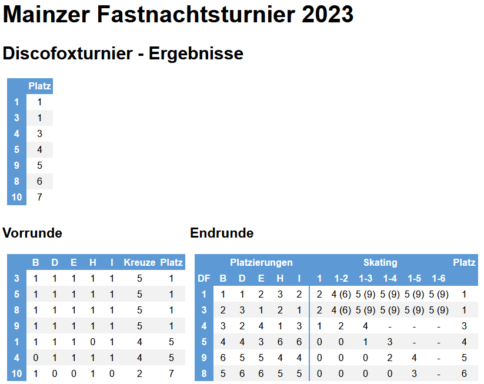

# pydanceweb

This Django app can be used to run (and analyze) dancing competitions.

## Requirements

- ensure that you have python installed (pydanceweb was developped and tested on version 3.12.2)
- build a python environment (e.g. with venv): `python -m venv pydance_env`
- activate the environment:
    - Win (cmd.exe): `pydance_env\Scripts\activate.bat`
    - Win (PowerShell): `pydance_env\Scripts\Activate.ps1`
    - Mac/Linux: `source pydance_env/bin/activate`
- run `pip install -r requirements.txt` in your python environment

## Adjusting the config

This app can be adjusted to the specifics of a dancing competition using the file `data/conf.json` which must be a valid JSON file and must not be moved to another destination. Please note that a sample conf is provided.

It contains the following key value pairs:
- `"name"`: sets the title of this app displayed on any page
- `"dances"`: a dictionary in the form `"SOME_ID": "SOME_NAME"` listing all dances that may appear in any section
- `"sections"`: a dictionary in the form `"SOME_ID": "SOME_NAME"` of all sections (i.e. "subcompetitions")
- `"dances_per_section"`: a dictionary in the form `"SECTION_ID": ["DANCE_ID_1", ...]` that expresses which dance is danced in which section. Please ensure that every ID is defined as a key in their respective dictionaries. Please note that you may also define a section without dances e.g. if you want to restrict award results to only certain competitors.
- `"registration_only_sections"`: an OPTIONAL list in the form `["SECTION_ID_1", ...]` that declares which sections should only be used as additional fields for registration but should not be displayed in any other view
- `"section_groups"`: a dictionary in the form `"SOME_ID": "SOME_NAME"` of all sections that should be grouped in the tournament desk view under the given name as header
- `"sections_per_group"`: a dictionary in the form `"SECTION_GROUP_ID": ["SECTION_ID_1", ...]` that expresses which sections should be grouped under which header in the tournament desk view. Please ensure that every ID is defined as a key in their respective dictionaries.
- `"max_heat_size"`: an OPTIONAL integer that specifies how many competitors are allowed to dance in the same heat (defaults to 8 - the maximum in a final round)
- `"awards"`: an OPTIONAL dictionary in the form `"SOME_ID": "SOME_NAME"` of all additional awards that are calculated on the basis of section results
- `"sections_per_award"`: an OPTIONAL dictionary in the form `"award_id": [SECTION_ID_OR_RULE, ...]` that defines how the respective award results should be calculated based on section results. Instead of a key from the `sections` dictionary you may also add a "rule" to the list of values. Such a rule must be in the form of a dictionary. There is currently only one rule in the form `"BEST": { "n": SOME_INT, "sections": ["SECTION_ID_1", ...]}` which is interpreted in the way that only the best `SOME_INT` results of the given sections are regarded while worse ones are ignored. Please note that this rule may not be nested! Please also note that competitors that did not compete in all specified sections (or a subset based on the rules) are excluded from the results. Finally, please note that only rule 9 of the skating system (i.e. the sum of the places) will be applied.

## Starting the Server

Run `python main/manage.py runserver` to start a local server or `python main/manage.py runserver  0.0.0.0:8000` to start one that can be accessed over the web (the `ALLOWED_HOSTS` from `main/settings.py` are configured in a way that the current IP address is always allowed). 127.0.0.1 will be `YOUR_IP_ADDRESS` in the first case or your actual IP4 address in the latter.

## Using the Tournament Desk View

Open http://`YOUR_IP_ADDRESS`/ftm/desk/ in a browser to access the tournament desk view. Here you can see all sections and awards from your conf enriched by the competitor/adjudicator information:

Please note that the number of adjudicators will be red if it is invalid (i.e. 0 or an even number).

### Managing Adjudicators

You can get an overview over all adjudicators by clicking on the top button in the tournament desk view:

(Please note that there won't be a table if there are no competitors yet.)

Here, you can see a table with name columns on the left and one column per section on the right. A green check mark signifies that an adjudicator is registered in a given section and a black minus that they are not. An explanation of each status icon is given on hover.

Please note that you may sort any column by clicking on its header.

All adjudicator data are saved to the file `data/adjudicators.csv`. This file must be separated by `,` and must include a first column without a header that contains adjudicator ids that are usually upper case characters. The following columns must have a `SECTION_ID` specified in the conf as header and a cell with a `1` if the adjudicator judges the section or a `0` if not.

### Managing Competitors

You can get an overview over all competitors by clicking on the top button in the tournament desk view:

(Please note that there won't be a table if there are no competitors yet.)

Here, you can see a table with basic competitor information columns on the left and one column per section on the right. A green check mark signifies that a competitor is registered in a given section, a light red background that they are not and a magenta question mark that they are preregistered. (The distinction between registration and preregistration is important because competitors may have preregistered earlier to the tournament but do not appear due to illness etc.) An explanation of each status icon is given on hover.

Please note that you may sort any column by clicking on its header and that you can get to a view for changing registrations by clicking on the starting number:

. Please note that preparing a round will alter the status of the section as displayed in the tournament desk view (after reloading):

### Starting a Round

Clicking on any of the last two buttons leads you to the view for actually starting a round:

This separate view enables you to postpone a round e.g. in case you're running multiple sections at a time and you want all final rounds to be danced together and not with a preliminary round of another section.

You will also have to set your callback wish (i.e. the number of competitors that should advance to the following round which equals the number of callback marks adjudicators should set) and whether you want to allow bigger heats. For the latter you will only see options that actually reduce the number of heats.

If you start a round you will get to the heats view which shows you that all competitors are randomnly placed in heats and that the heat sizes will be as balanced as possible with fewer competitors in later heats. Here you will also find the option to move competitors to the last heat of the current round e.g. if they can't be found at the moment but you want to give them the chance to still compete a little later:

Please note that this option will not be available if there is only one heat:

Please also note that starting a round will again change its status in the tournament desk view:

The heat table will be saved to `data/sections/SECTION_ID/ROUND_NO/SECTION_ID_ROUND_NO_heats.csv` and can be edited externally if necessary.

### Analyzing a Round

From the heats view you can access the round view via the top left button (and from there you can get back vice versa):

In this view you can remove all round data and go back to the last round (e.g. if you accidentally moved on to the next round early or chose an unwanted callback option).

You can also access the adjudicator views to edit their callback marks (e.g. in case they have problems or in order to print adjudicator sheets) and press the reload button to update the current result table with callbacks marks from adjudicators.

Having done so, you can move on to the next round by selecting the number of competitors that should be called back. Please note that this will lead to a final round if noted that way. (A final is every non first round with 6 or less competitors or up to 8 if the 7th and or 8th are tied with the 6th.)

### Handling Final Rounds and Finishing a Section

The view for preparing a final round is similar to the one mentioned above with the only difference that you don't have to specify a callback wish or heat size limit:

The view for a running final round and its analysis is also pretty similar to the one used for preliminary rounds with the exception of including a skating table for each dance of the current round (and a final summary for multi dance sections):

(c.f. https://www.worlddancesport.org/Rule/Athlete/Competition/Judging-Systems if you're interested in how the skating system works)

If you click on the button to finalize the section you will get to the section results view:

In this view you can get back to the final round view by clicking the reset button (which may once again be useful if you accidentally moved on to this view too early).

All skating tables will be saved to  `data/sections/SECTION_ID/ROUND_NO/SECTION_ID_ROUND_NO_DANCE_NO_results.csv`, the final summary to `data/sections/SECTION_ID/ROUND_NO/SECTION_ID_ROUND_NO_results.csv` and a table with places for all competitors (merged from all rounds of the section) to `data/sections/SECTION_ID/results.csv`.

... and the status changes one last time:

If you click on this button you will no longer be able to start new rounds but get a more detailed section view:

### Handling Additional Awards

If you specified additional awards in the conf you will see additional buttons for them on the bottom of the tournament desk view:

Please note that you will only see results if all sections necessary for the calculation of this award are finished.

Each one of those award results table will be saved to `awards/AWARD_ID.csv` and will be updated every time you click on the button.

### Getting a Result Overview

A compact overview over the results of all sections and all awards tabulated so far can be accessed from the bottom most button of the result view:

It may look like this:

This table will be saved to `data/results.csv` and will be updated every time you click on the button.

## Using the Adjudicator View

Open http://`YOUR_IP_ADDRESS`/ftm/judge_`ADJUDICATOR_ID`/ in a browser to access the view for the adjudicator with that id:

On this landing page you will always get a list of all rounds that are currently running but the only ones the given adjudicators judges.

### Judging Preliminary Rounds

Clicking a button on the adjudicator landing page that is associated with a preliminary round will get you to this view:

Here you can see the callback wish in bold on top of a box per heat and the number of selected callback marks on top of the send button. Please note that this number will be red if it does not match the callback wish.

Please also note that adjudicators have to reload this page if competitors are moved to another heat although all heats of the given round are visible at the same time.

Adjudicators may preselect competitors in this view using the right column with grey x marks in case they need to allocate some callback marks at the end of the round as they don't have to allocate them equally over all heats. However, these "preselection marks" will not be saved by clicking the send button.

The marks will be saved to `data/sections/SECTION_ID/ROUND_NO/SECTION_ID_ROUND_NO_DANCE_ID_callback_marks_ADJUDICATOR_ID.json` in the form `{"competitors": [COMPETITOR_TO_BE_CALLED_BACK, ...]}` and can be edited externally if necessary.

Please note that this view will be styled differently if printed using the browser's printing option:

After saving the callback marks you will be redirected to the following page from which you can access the overview (or the next dance in case of multi dance sections):

### Judging Final Rounds

Since there are no callback marks but placements in final rounds, the adjudicator view for final rounds looks a little different:

Please note that the send button will be invisible if the placements are invalid.

Please also note that the styling used for printing looks once again differently:

The placements will be saved to `data/sections/SECTION_ID/ROUND_NO/SECTION_ID_ROUND_NO_DANCE_ID_final_marks_ADJUDICATOR_ID.json` in the form `COMPETITOR: PLACEMENT` and can be edited externally if necessary.

## Using the Chair View

### Current Rounds

All rounds that are currently running will be listed on the chair index page (http://`YOUR_IP_ADDRESS`/ftm/chair/):

If you click one of the buttons you will get to a heat view where you can't judge or move competitors:

If you select a final round you will get a similar view:

## Additional Views

### Current Rounds and Heats

All rounds that are currently running will also be listed on the index page (http://`YOUR_IP_ADDRESS`/ftm/). Here, you will always find a "merged" heat table for all these rounds:

Please note that this table will be styled differently if you use your browser's printing option:

If you click one of the buttons at the left side of the page you will get to a heat view where you can't judge or move competitors:

(Please note that final rounds will not be accessible from this view!)

### Results

If there are any finished sections you will also find links to the detailed results view below the current round overview:

However, this view will lack a reset option:

## TODOs

While the app is fully functional (especially for single dance sections), there are still some additions that may be implemented in the future:

- make it possible to upload competitor/adjudicator participations in the tournament desk view
- make it possible to print all adjudicator sheets for a given round at once
- make it possible to redraw the heats from the tournament desk heat view
- make it possible to add competitors to running sections
- make it possible to also use rule 10 for additional awards
- make it possible to have a general look round without letting the adjudicators give crosses to all competitors
- make it possible to add a redance round
